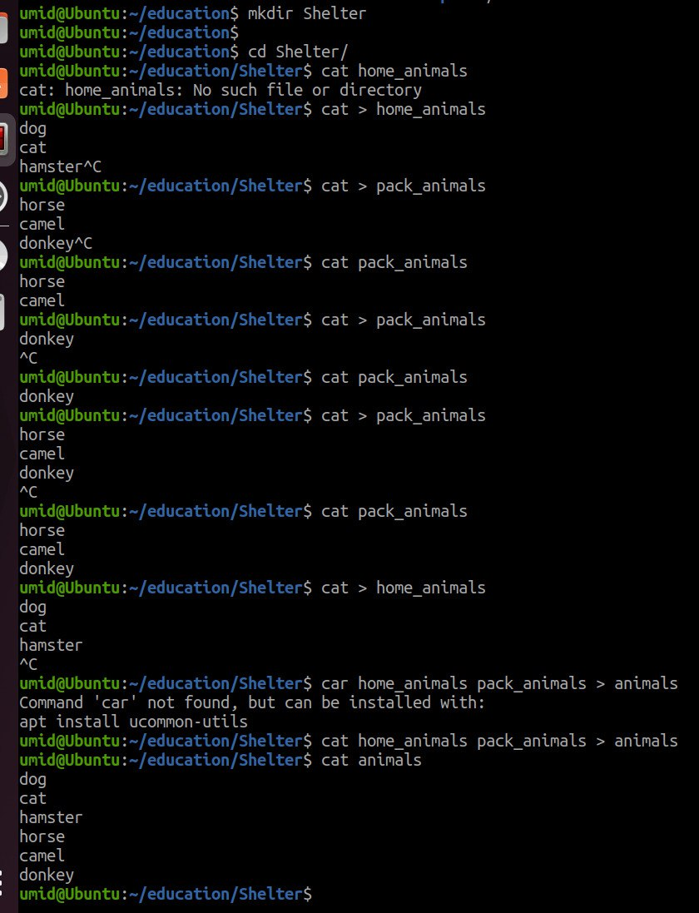
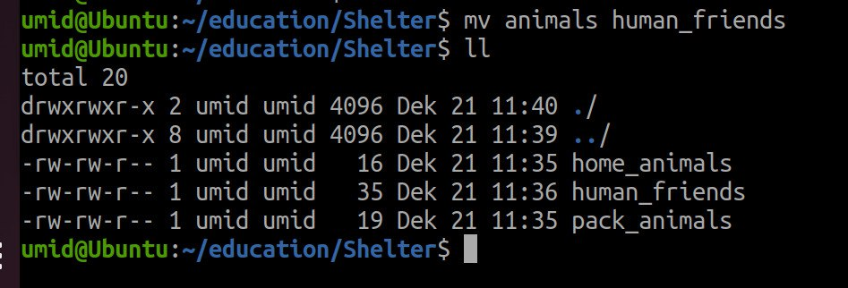
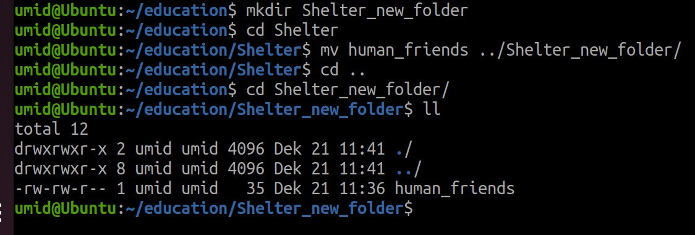
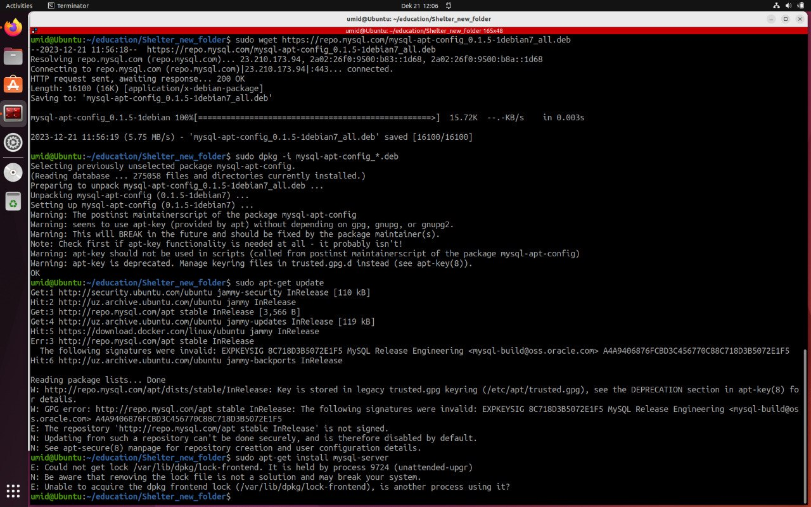
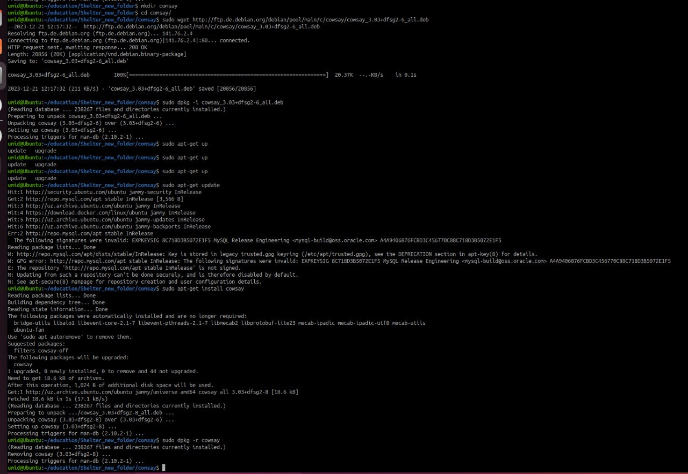

## Task 1
mkdir Shelter    
cd Shelter    
cat > home_animals    
dog
cat
hamster

cat > pack_animals  
horse
camel
donkey

cat home_animals pack_animals > animals    
cat animals    
mv animals human_friends    
ll

## Task 2
cd ..    
mkdir Shelter_new_folder    
cd Shelter
mv mans_friends ../Shelter_new_folder    
cd ../
cd Shelter_new_folder   
ll

## Task 3
sudo wget https://repo.mysql.com/mysql-apt-config_0.1.5-1debian7_all.deb    
sudo dpkg -i mysql-apt-config_*.deb     
sudo apt-get update     
sudo apt-get install mysql-server   

## Task 4
mkdir cowsay    
cd cowsay   
sudo wget http://ftp.de.debian.org/debian/pool/main/c/cowsay/cowsay_3.03+dfsg2-6_all.deb    
sudo dpkg -i cowsay_3.03+dfsg2-6_all.deb    
sudo apt-get update     
sudo apt-get install cowsay     
sudo dpkg -r cowsay   

